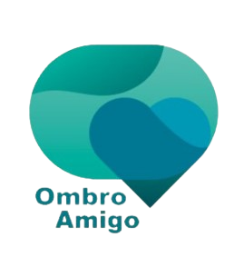
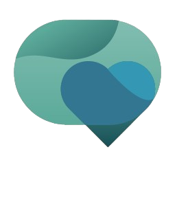

<div align="center">
  
  <br/><br/>
  <em>"A shoulder to lean on"</em>
  <br/>
  A mental health and wellness web platform connecting users with qualified healthcare professionals.
  <br/><br/>

  [](License)
  
  
  
  
</div>

---

## 📖 About

**Ombro Amigo** (Portuguese for *"Friend's Shoulder"*) is a web platform developed to address the growing demand for accessible mental health and wellness services. The platform connects users with certified professionals across multiple health disciplines, offering a simple and welcoming digital experience.

This project was developed as a **PAP (Professional Aptitude Test / Prova de Aptidão Profissional)**, a final practical assessment required for Portuguese vocational secondary education (Curso Profissional).

---

## ✨ Features

- **Multi-discipline service booking** — Connect with professionals in:
  - 🧠 Psychology
  - 💊 Psychiatry
  - 🩺 General Medicine
  - 🥗 Nutrition
- **User registration & login system**
- **Responsive web interface** optimized for all screen sizes
- **Database-driven** architecture with persistent data storage

---

## 🛠️ Tech Stack

| Layer | Technology |
|---|---|
| Backend | PHP |
| Frontend | HTML, CSS, JavaScript |
| Database | SQL Server (T-SQL) |
| Hosting | Microsoft Azure (App Service) |
| Server Config | `.htaccess`, `web.config`, `php.ini` |
| CI/CD | GitHub Actions |

---

## 📁 Project Structure

```
OmbroAmigo/
├── .github/
│   └── workflows/          # GitHub Actions CI/CD pipelines
├── Database/               # SQL scripts and database schema
├── Ombro Amigo v2/         # Main application source (v2)
│   └── initial page/
│       └── index.php       # Application entry point
├── index.php               # Root redirect to application
├── .htaccess               # Apache URL rewriting rules
├── web.config              # IIS / Azure configuration
├── php.ini                 # PHP runtime configuration
└── layout.js               # Shared layout/UI scripts
```

---

## 🚀 Getting Started

### Prerequisites

- PHP 7.4 or higher
- A web server (Apache / IIS)
- SQL Server or compatible database
- A database client to run the schema scripts

### Local Setup

1. **Clone the repository**
   ```bash
   git clone https://github.com/GuilhermeDuarteB/OmbroAmigo.git
   cd OmbroAmigo
   ```

2. **Set up the database**
   - Open the `Database/` folder
   - Run the SQL scripts against your SQL Server instance to create the schema and seed initial data

3. **Configure your environment**
   - Update database connection details in the relevant PHP configuration files
   - Adjust `php.ini` if needed for your local PHP setup

4. **Serve the application**
   - Point your web server root to the repository folder
   - Or use PHP's built-in server for quick testing:
     ```bash
     php -S localhost:8000
     ```

5. **Open in browser**
   ```
   http://localhost:8000
   ```

---

## 🎯 Motivation

Mental health care demand has risen significantly in recent years. **Ombro Amigo** was created to help bridge the gap between people seeking help and qualified healthcare professionals — offering an accessible, stigma-free digital gateway to wellness services.

---

## 👨‍💻 Author

**Guilherme Duarte**
- GitHub: [@GuilhermeDuarteB](https://github.com/GuilhermeDuarteB)

---

## 📄 License

This project is licensed under the **MIT License** — see the [License](License) file for details.

---

<div align="center">
  
  <br/>
  <i>Made with ❤️ as a PAP project — because everyone deserves a shoulder to lean on.</i>
</div>
